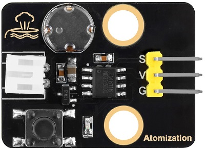
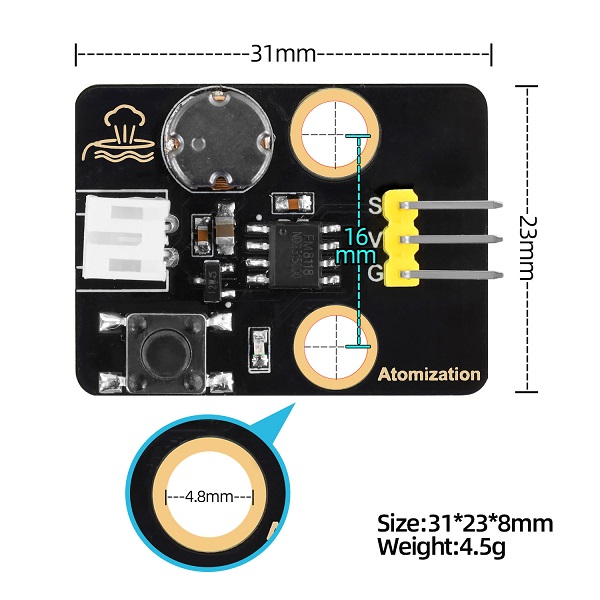
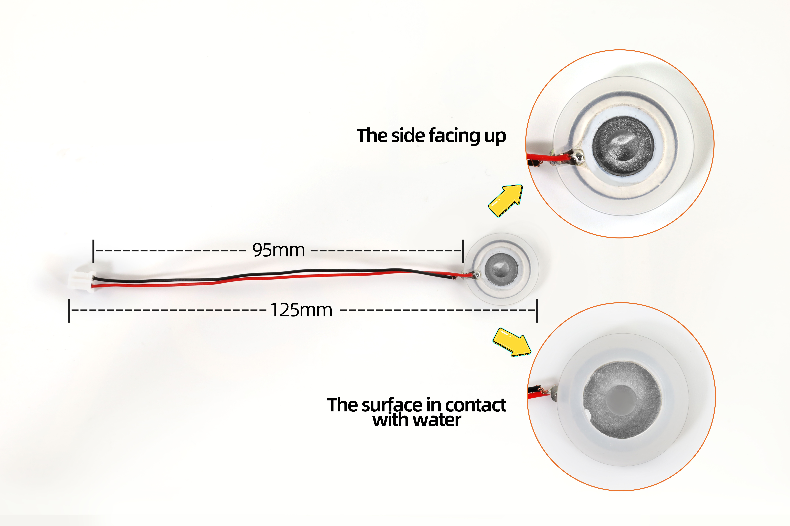
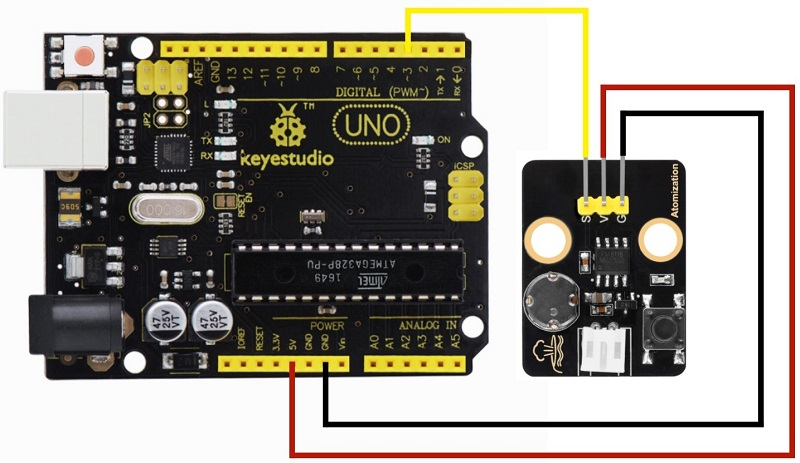
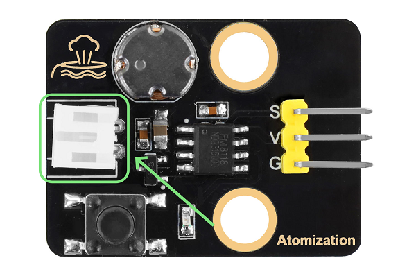
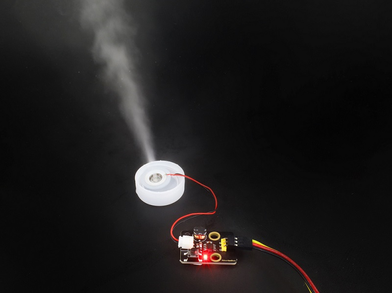
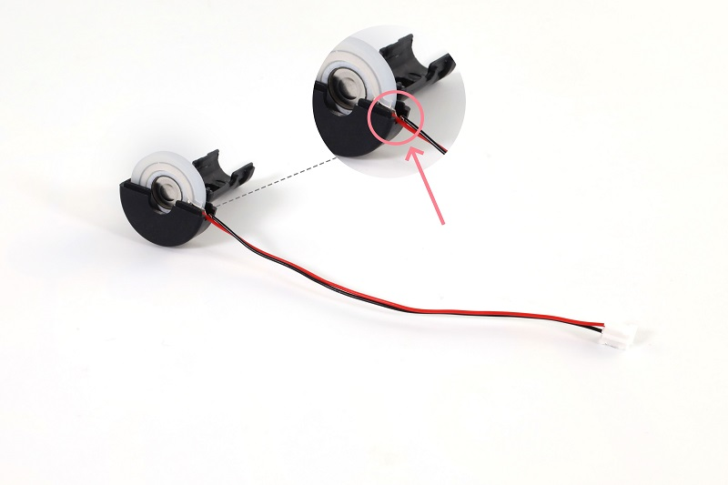
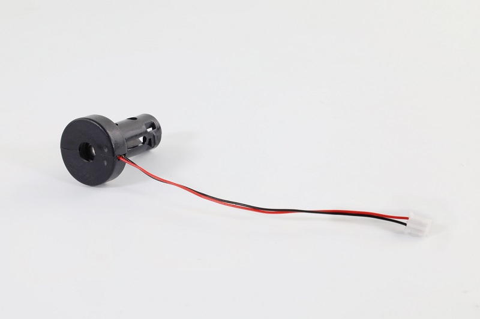
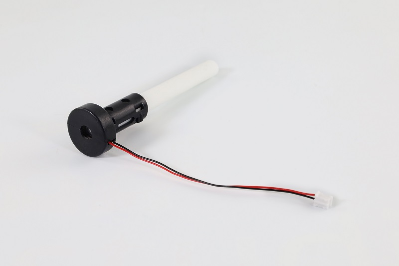
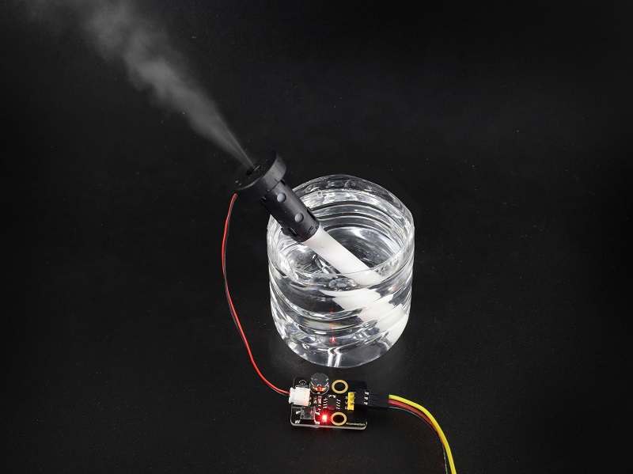

# Keyestudio Atomization Module



## Resources Download

[code](./code.zip)


## Introduction

The atomization module is composed of a drive module and an atomizer, which is used to atomize and humidify the water. It can be controlled by MCU or buttons. V is connected to 3~5V voltage input, G is connected to GND, and S is the signal pin.

Working principle: The module usually produce water mist through ultrasonic technology. It contains a piezoelectric ceramic sheet that begins to vibrate when a high frequency voltage is applied through it. Its vibration generates small water droplets on the surface of the water that are dispersed to form fine mist.

Water mist quality: This module can effectively convert moisture into tiny water particles, usually in the range of 1 to 5 microns. This fine mist evaporates and diffuses more easily in the air, enhancing the humidification.

**Cautions:**

**1. After turning on, the atomizer should be put into the water. Or it will be overheated and burned out in the air for a long time.**

**2. The atomizer should be put on the water surface. If it is submerged into the water, mist may not be successfully generated.**


## Parameters

- Operating voltage: 3.3V/5V
- Installation hole parameters: diameter of 4.8mm, spacing 16mm
- Module dimensions: 31mm long, 23mm wide, 8mm high
- Weight: 4.5g
- Operating temperature: -25°C to +60°C
- Module interface: 3pin spacing 2.54, bent pin
- Atomizer interface: PH2.0 female
- Function: convert water into a fine mist and release it into the air


## Dimensions

### Module Dimensions




### Atomizer Dimensions




## Wiring Diagram




Connect the atomizer to the PH2.0 female pin of the module, as shown below.




## Operating Instructions

There are two control modes for this module: automatic control by pressing a button, and MCU programming control.

**Button Control:** Press the button to turn on the module. Press it again to turn the module off.

**MCU Programming:** Simulate a button is pressed. The button outputs high level in normal state, and low when pressed; Release the button to output the high level again.

Therefore, when programming on MCU, only a short low level is required to input to the module to simulate the button being pressed. Then enter a high level, and control its duration to control the start and pause of the module.


## Test Code

```c
int atomization = 3;  //Set the pin of the atomization module
void setup() {
  pinMode(atomization, OUTPUT);//set the pin to output
  digitalWrite(atomization, HIGH);//set the pin to high  
}

void loop() {
  //Turn on the atomization module, equivalent to pressing a button
  digitalWrite(atomization, LOW);   
  delay(200);  
  digitalWrite(atomization, HIGH); 
  delay(3000); 
  //Turn off the atomization module, equivalent to pressing the button again
  digitalWrite(atomization, LOW); 
  delay(200); 
  digitalWrite(atomization, HIGH);   
  delay(1000);
}
```


## Code Explanation

| Code                            | Explanation                                                  |
| ------------------------------- | ------------------------------------------------------------ |
| pinMode(atomization, OUTPUT)    | Set the pin to output.                                       |
| digitalWrite(atomization, HIGH) | Set the output voltage of the pin to HIGH/LOW                |
| delay(1000)                     | Pause the execution of the program for a period of time, called a delay. <br>The unit is milliseconds. |


## Test Result

### Atomizer

**Face the front of the atomizer up, and put it gently on the surface of the water. Note that the front should be not covered by water.**


Upload the code to the board and wire up. After that, put the atomizer on the water surface and it starts to work and repeats: it sprays mist for 3 seconds and stops for 1 second.




### Cotton Rod

How to install the cotton rod for humidifying to the atomizer:

Put the atomizer in the plastic shell. Pay attention that its connection wire should be placed in the groove of the plastic shell.




Cover the other half of the shell.




Insert the cotton rod into the middle of the plastic shell.



The installation is complete.

**Note: The cotton rod takes time to absorb water. If it is not full of water, the atomizater may be burned out after powering on. To avoid this condition, please insert the rod into the water first, and then upload the code after the water is fully absorbed in it.**


Wire up, insert the cotton rod into the water and wait for 2 to 3 minutes. After it is full of water, upload the code to the board, and the atomizer starts to work and repeats: it sprays mist for 3 seconds and stops for 1 second.

Since water absorption rate of the cotton rod is slow, after a long time of work, the atomizer may stop working for 2~3 seconds after each period of atomizing. Until the rod absorbs enough water, it works again.